  

  <a href="https://www.linkedin.com/in/thdatvu2404/">LinkedIn</a>
  ·
  <a href="mailto:vuthanhdat181@gmail.com">Email</a>
  ·
  <a href="https://x.com/DatVT2404">X</a>

## About

I'm **Vu Thanh Dat** (ヴ・タイン・ダット), a full-stack software engineer who enjoys turning clear logic into dependable products. I build with care, learn by shipping, and pay attention to the edge cases.

- Exploring opportunities and side projects with Java/Spring Boot, Python/FastAPI, and Go/Gin.
- Interested in well-designed systems, practical developer tooling, and products that make a real difference.

## Stack

`Go` · `Python` · `Java` · `TypeScript` · `Gin` · `FastAPI` · `Spring Boot` · `Next.js` · `React` · `PostgreSQL` · `MongoDB` · `Supabase` · `Redis` · `Docker` · `GCP`

---

  <i>“Engineering (n): change the world and have a dream life.”</i>

